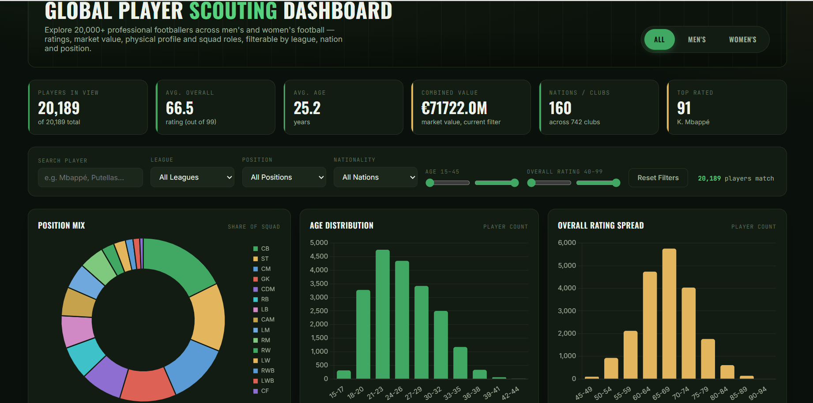

# ⚽ Global Player Scouting Dashboard

An interactive, single-file HTML dashboard for exploring 20,000+ professional footballers (men's and women's football) using the SoFIFA / FIFA 24 player ratings dataset. Built with vanilla JavaScript and Chart.js — no backend or build step required.

**[🔴 Live Demo](https://sithuminiNK.github.io/football-scouting-dashboard/)**

---

## 📊 Overview

This dashboard lets users filter, sort, and visually explore a real-world dataset of professional footballers by league, nationality, position, age, and overall rating — combining KPI summaries, six interactive charts, a sortable/paginated player directory, and a "scouting card" detail view for individual players.

## ✨ Features

- **KPI Summary Strip** — live-updating stats (players in view, average overall rating, average age, combined market value, nations/clubs covered, top-rated player)
- **Multi-filter System** — gender toggle (All / Men's / Women's), text search, league, position, and nationality dropdowns, plus age and overall-rating range sliders
- **Six Interactive Charts** (Chart.js)
  - Position mix (doughnut)
  - Age distribution (bar)
  - Overall rating spread (bar)
  - Top 12 nationalities by player count (horizontal bar)
  - Strongest leagues by average rating (horizontal bar)
  - Market value vs. overall rating (scatter plot)
- **Player Directory Table** — sortable columns, pagination, live search
- **Player Spotlight Card** — click any player row to see a FIFA-card-style profile with a radar chart of their core attributes (Pace, Shooting, Passing, Dribbling, Defending, Physical)
- **Fully Offline-Capable** — Chart.js is bundled directly into the HTML file, so the dashboard works without an internet connection once downloaded

## 🛠️ Built With

- **HTML5 / CSS3** — custom design system (CSS variables, responsive grid)
- **Vanilla JavaScript (ES6)** — filtering, sorting, pagination, and state management, with no frameworks
- **[Chart.js](https://www.chartjs.org/)** — bar, doughnut, radar, and scatter charts
- **Python (pandas)** — used offline to clean and compact the raw dataset before embedding it into the page

## 📁 Dataset

Source: [SoFIFA FIFA Player Ratings](https://www.kaggle.com/datasets) — filtered to the FIFA 24 (September 2023) snapshot, combining the men's and women's player datasets (20,189 players total). Only the columns needed for the dashboard were kept, and the data was compacted into a column/row JSON format to minimize file size before being embedded directly in the HTML.

## 🚀 How to Run

No installation needed — this is a single self-contained HTML file.

1. Download `index.html` from this repository
2. Open it directly in any modern browser (Chrome, Edge, Firefox)

Or just use the **[live demo](https://sithuminiNK.github.io/football-scouting-dashboard/)** link above.

## 📌 What I Learned

- Structuring and cleaning a large real-world dataset (180,000+ rows) with pandas, and reducing it to a web-friendly size
- Building a filter/sort/pagination system in vanilla JavaScript using a single central state object
- Working with Chart.js to build multiple chart types driven by the same filtered dataset
- Designing a cohesive visual theme with a CSS custom-properties design system
- Debugging a real deployment issue (an external CDN script failing to load) by bundling the dependency locally instead

## 👤 Author

**Nirasha** — BSc (Hons) IT, Data Science, SLIIT
GitHub: [@sithuminiNK](https://github.com/sithuminiNK)
